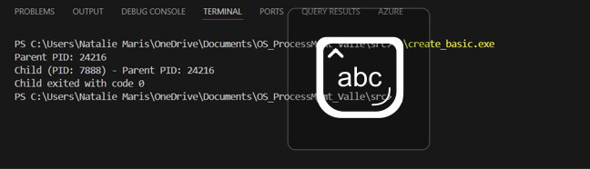
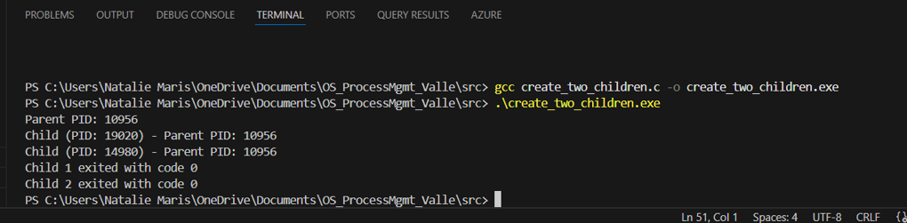
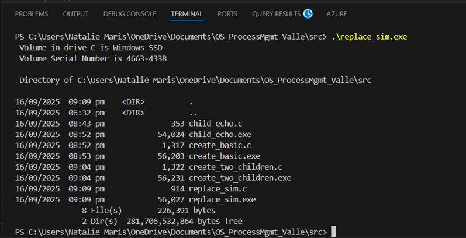
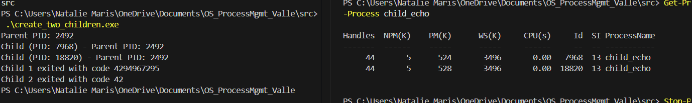
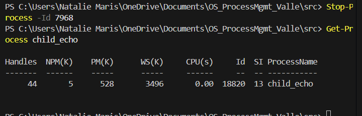

# OS_LA1_ProcessMgmt_Valle

## Build Instructions

### Using VS Code (MinGW)
1. Open the terminal in the `src/` folder.
2. Compile the C programs by typing:

- gcc create_basic.c -o create_basic.exe
- gcc child_echo.c -o child_echo.exe
- gcc create_two_children.c -o create_two_children.exe
- gcc replace_sim.c -o replace_sim.exe

3. Run the programs using:

- ./create_basic.exe
- ./create_two_children.exe
- ./replace_sim.exe

## Sample Outputs

### Task A – Single Child

### Task B – Two Children

### Task C – Simulating exec()

### Task D – Managing Processes in PowerShell

#### Before Termination

#### After Termination

---

## Notes on Results

### Task A
- Parent PID and child PID printed correctly.
- Child process exit code returned successfully.

### Task B
- Two child processes ran in parallel.
- Execution order may vary between runs.

### Task C
- Parent process ended quickly after spawning `cmd /c dir`.
- Exit code matched the spawned program.

### Task D
- Forced termination (`Stop-Process`) ends child immediately.
- Normal termination allows child to finish and return its exit code.

---

## Screenshots Folder
All screenshots referenced above are located in the `screenshots/` folder in this repo.

